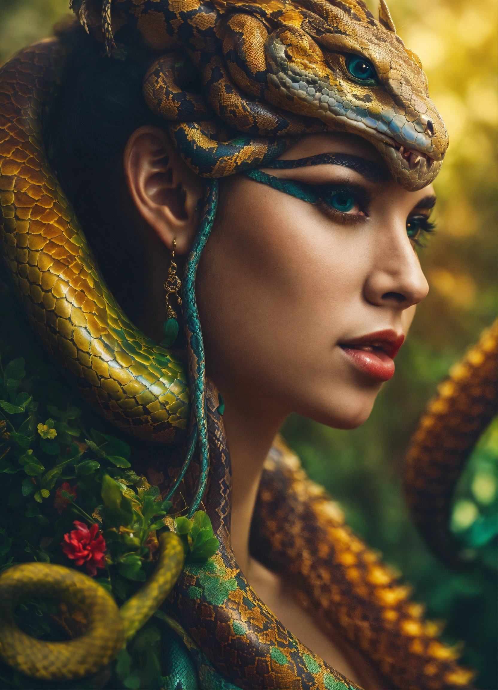

  

# Artigo técnico sobre Orientação a Objetos em Python - criado com ajuda de I.A e revisado por humano
## (...que coisa não?)

Conclusão de projeto de artigo para DIO sobre Orientação a Obejtos em Python

<a href="https://web.dio.me/articles/desmistificando-a-orientacao-a-objetos-em-python-um-guia-pratico-para-iniciantes-e-alem?back=%2Farticles&page=1&order=oldest" title="Abrir o PDF aqui"> Meu artigo na DIO</a>

##  Tecnologias utilizadas no projeto

- [ChatGPT](https://chat.openai.com/) - auxilio para geração do conteúdo
- [Lexica.art](https://lexica.art/) - geraração de imagens
- [PowerPoint](https://www.microsoft.com/en/microsoft-365/powerpoint) - Utilizado para diagramação do artigo

## Prompts

ChatGPT:

prompt                                                                                                                                                                                                                                                                         |
| :------: | 
|  título  |

- Crie 10 headlines para nomes de artigos sobre o assunto Python - Orientação a Objetos                                                                                                                                                                                                   |
| conteúdo |

- Comporte-se com um Engenheiro de Software Sênior Python com mais de 10 anos de experiência em escrita de artigos tech de back-end e escreva o Artigo |

Lexica.art:

- Para criação da imagem, utilizei a ferramenta gratuita do lexica.art que permite através da licença pública utilizar a imagem gerada para conteúdo gratuito. E foi usado o seguinte prompt para criação da imagem:

prompt                                                                                                                                                                                                                                                                         |
| :------: |

- a woman envolved by a Python dominating her while look forward

##  Características

- Conteúdo gerado via ChatGPT e revisado por mim e também com vários acréscimos
- Imagens do acervo público geradas via Lexica.art

# Agradecimentos

Agradeço minha família pela ajuda. Também a DIO na pessoa do Felipe Aguiar que é realmente um expert em I.A.´s

E também a você chegou até aqui!
